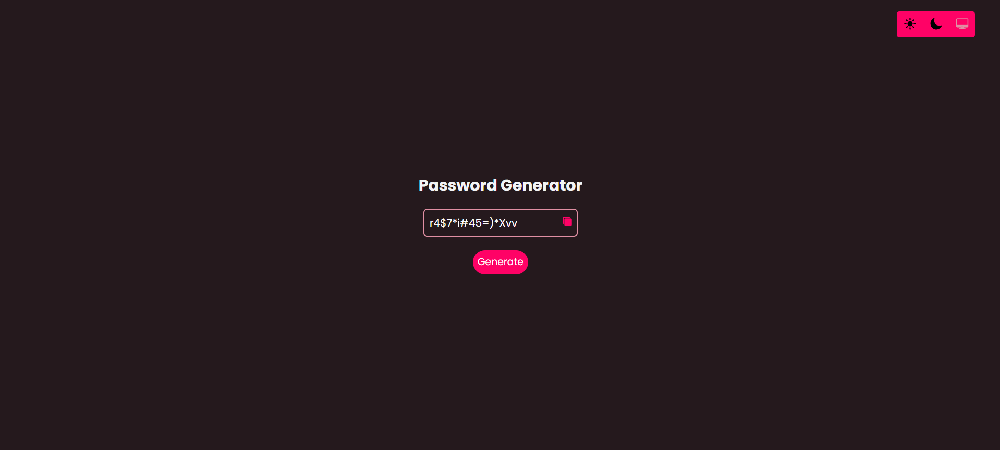
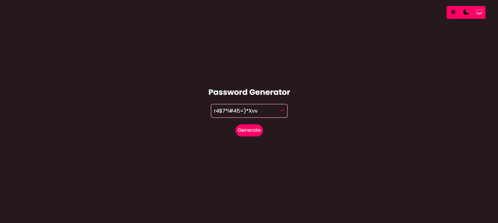
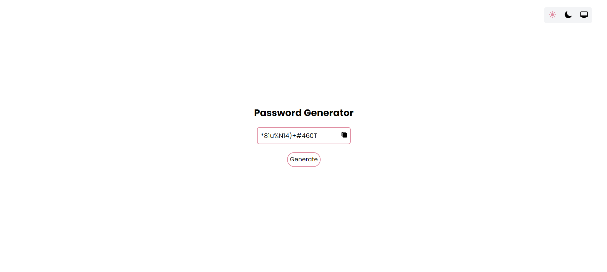
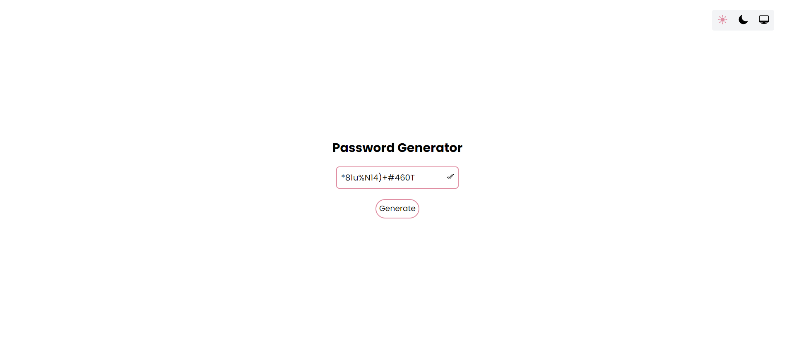

## 🔑 `Password Generator App`

<br>

- URL

```url
https://password-generator-furkankayam.netlify.app/
```

<br>

- ✅ Password Generator App

<br>

<div align="center">
<h3>⚡Dark</h3>


<h3>⚡Light</h3>


</div>

<br>
<br>

Used Technologies in The Project:

[](https://react.dev/)
[](https://tailwindcss.com/)
[](https://ionic.io/ionicons)
[](https://web.dev/explore/progressive-web-apps?hl=tr)

<br>

### Installation

```bash
git clone https://github.com/furkankayam/password-generator.git
```

<br>

### Usage

```bash
npm run dev
```

<br>

### URL

```bash
http://localhost
```

<br>

<br>

# License

This project is licensed under the MIT License. See the [LICENSE](./LICENSE) file for details
